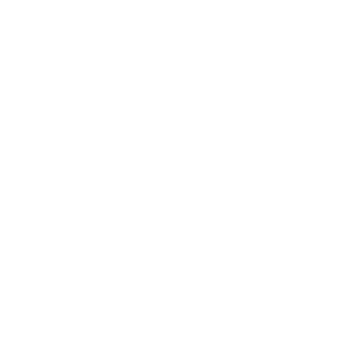

# Advanced Vanilla Objects

    

    
    
    
     
    
    

__Requires__ [CBA_A3](https://github.com/CBATeam/CBA_A3), [ACE3](https://github.com/acemod/ACE3) and Arma 3 Contact content. The antennas also need [ACRE2](https://github.com/IDI-Systems/acre2), and the BWA3 tent needs [BWA3](https://steamcommunity.com/sharedfiles/filedetails/?id=1200127537). If a dependency of an addon is missing, that addon is skipped instead of throwing errors (`skipWhenMissingDependencies`).

__Advanced Vanilla Objects__ (AVO) fills vanilla objects with the functions they should have had. Currently: connect ACRE radios to the vanilla Contact antennas and terminals, read the portable weather station, set up and pack up tents, and open, close, extend or switch objects that could only be changed in the editor.

The project is entirely __open-source__ and any contributions are welcome.

Steam Workshop: <https://steamcommunity.com/sharedfiles/filedetails/?id=0>
Discord: <https://discord.gg/ag4v6kxYAa>

## Features

- __Antennas__ — connect a compatible ACRE radio (PRC-117F, PRC-152) to the vanilla Contact satellite antennas, omni-directional antennas and Rugged communications terminals (which must be activated first, with an ACE action or "Open terminal" in the editor) via the ACE interaction menu, like ACRE's ground spike antenna. The antenna sits at the real tip of the model, so height matters for signal. The link drops when the radio is more than 10 m from the antenna.
- __Weather__ — ACE action on the portable weather station (Contact) that reads precise weather data: wind at the anemometer, temperature, humidity, dew point and pressure from ACE weather, plus overcast, rain and fog.
- __Tents__ — packed tent items (solar tents in four colours, dome tent, A-frame tent, and the BWA3 small tent with BWA3 loaded) that are set up with ACE's 3D placement (mouse wheel rotates, left click confirms, right click cancels). Placed tents of these classes get a "Pack Up Tent" action that gives the item back. Set the `avo_tents_canPackUp` variable of a tent to false to prevent packing it up.
- __Animations__ — ACE actions for vanilla objects that have animations but no way to change them in the game (most only had editor attributes): drawers of the portable cabinets, office table and coffins, doors of the fridge, coffins and the decon, connector and medical tents, lids of laptops, computers and containers, transfer switch, portable server, data terminal antenna and flag pole. Actions only show for variants that have the animation. Solar panels (rotate and tilt) are a separate addon that is skipped when Advanced Equipment is loaded.

## Affected objects

Every class listed here also covers everything derived from it, so variants added by other mods work too. The actions are in the ACE interaction menu of the object (hold the interact key and look at it). Actions of an object that has several are in a sub menu.

### Antennas

#### Satellite dishes and omni-directional antennas

Connect and disconnect an ACRE radio (PRC-117F, PRC-152). The mounted dishes (`SatelliteAntenna_01_Mounted_*`, `SatelliteAntenna_01_Small_Mounted_*`) have no actions, they are out of reach.

`Land_SatelliteAntenna_01_F`, `SatelliteAntenna_01_Black_F`, `SatelliteAntenna_01_Olive_F`, `SatelliteAntenna_01_Sand_F`, `SatelliteAntenna_01_Small_Black_F`, `SatelliteAntenna_01_Small_Olive_F`, `SatelliteAntenna_01_Small_Sand_F`, `OmniDirectionalAntenna_01_black_F`, `OmniDirectionalAntenna_01_olive_F`, `OmniDirectionalAntenna_01_sand_F`

#### Rugged communications terminals

Sub menu "Terminal": activate and deactivate the terminal, connect and disconnect a radio once it is active.

`RuggedTerminal_01_communications_F`, `RuggedTerminal_01_communications_hub_F`, `RuggedTerminal_02_communications_F`

### Weather

#### Portable weather stations

Read the weather data: wind, temperature, humidity, dew point, pressure, overcast, rain and fog.

`Land_PortableWeatherStation_01_olive_F`, `Land_PortableWeatherStation_01_sand_F`, `Land_PortableWeatherStation_01_white_F`

### Tents

#### Packed tents and placed tents

Set up a tent from a packed tent item (equipment menu of the player, with 3D placement) and pack it up again. The BWA3 small tent (`BWA3_Tent_small_Fleck`) works the same with BWA3 loaded.

`Land_TentSolar_01_olive_F`, `Land_TentSolar_01_sand_F`, `Land_TentSolar_01_redwhite_F`, `Land_TentSolar_01_bluewhite_F`, `Land_TentDome_F`, `Land_TentA_F`

### Animations

#### Portable cabinets

Sub menu "Drawers": open and close each drawer (4 drawers, 5 for the 7 drawer cabinet, 6 for the medical cabinet).

`Land_PortableCabinet_01_4drawers_black_F`, `Land_PortableCabinet_01_4drawers_olive_F`, `Land_PortableCabinet_01_4drawers_sand_F`, `Land_PortableCabinet_01_7drawers_black_F`, `Land_PortableCabinet_01_7drawers_olive_F`, `Land_PortableCabinet_01_7drawers_sand_F`, `Land_PortableCabinet_01_medical_F`

#### Office tables

Sub menu "Drawers": open and close the two drawers.

`OfficeTable_01_new_F`, `OfficeTable_01_old_F`

#### Coffins

The wooden coffin: sub menu "Doors" to open and close its two doors. The other coffins: open and close the drawer, where the model has one.

`Coffin_01_F`, `Coffin_02_Cover_F`, `Coffin_02_Cover_US_F`, `Coffin_02_F`, `Coffin_02_US_F`

#### Fridges

Open and close the door.

`Fridge_01_closed_F`, `Fridge_01_open_F`

#### Laptops and computers

Open and close the laptop lid or the screens of the computer.

`Land_Laptop_02_F`, `Land_Laptop_02_unfolded_F`, `Land_MultiScreenComputer_01_black_F`, `Land_MultiScreenComputer_01_closed_black_F`, `Land_MultiScreenComputer_01_closed_olive_F`, `Land_MultiScreenComputer_01_closed_sand_F`, `Land_MultiScreenComputer_01_olive_F`, `Land_MultiScreenComputer_01_sand_F`

#### CBRN containers and buckets

Open and close the lid.

`CBRNContainer_01_closed_olive_F`, `CBRNContainer_01_closed_yellow_F`, `CBRNContainer_01_olive_F`, `CBRNContainer_01_yellow_F`, `Land_PlasticBucket_01_closed_F`, `Land_PlasticBucket_01_open_F`

#### Portable servers

Sub menu "Controls": extend and retract the server rack, turn the LED lights on and off. The server covers are not included.

`Land_PortableServer_01_black_F`, `Land_PortableServer_01_olive_F`, `Land_PortableServer_01_sand_F`

#### Solar panels

Sub menu "Solar panels": rotate the panels and tilt both panels in steps. These are in their own addon, "Animations (Solar)", which is skipped when [Advanced Equipment](https://github.com/y0014984/Advanced-Equipment) (`ae_main`) is loaded, because it has its own controls for them (needs Arma 3 2.22, older versions load it anyway).

`Land_SolarPanel_04_black_F`, `Land_SolarPanel_04_olive_F`, `Land_SolarPanel_04_sand_F`

#### Transfer switch

Sub menu "Controls": set the switch to position 1, off or position 2, and turn the indicator lamp on and off.

`Land_TransferSwitch_01_F`

#### Data terminal

Extend and retract the antenna.

`Land_DataTerminal_01_F`

#### Flag pole

Raise and lower the flag.

`PortableFlagPole_01_F`

#### Decon tents

Sub menu "Doors": open and close the two doors.

9 classes

`Land_DeconTent_01_AAF_F`, `Land_DeconTent_01_CSAT_brownhex_F`, `Land_DeconTent_01_CSAT_greenhex_F`, `Land_DeconTent_01_IDAP_F`, `Land_DeconTent_01_NATO_F`, `Land_DeconTent_01_NATO_tropic_F`, `Land_DeconTent_01_wdl_F`, `Land_DeconTent_01_white_F`, `Land_DeconTent_01_yellow_F`

#### Connector tents

Sub menu "Doors": open and close the doors of the variants that have them.

21 classes

`Land_ConnectorTent_01_AAF_closed_F`, `Land_ConnectorTent_01_AAF_cross_F`, `Land_ConnectorTent_01_AAF_open_F`, `Land_ConnectorTent_01_CSAT_brownhex_closed_F`, `Land_ConnectorTent_01_CSAT_brownhex_cross_F`, `Land_ConnectorTent_01_CSAT_brownhex_open_F`, `Land_ConnectorTent_01_CSAT_greenhex_closed_F`, `Land_ConnectorTent_01_CSAT_greenhex_cross_F`, `Land_ConnectorTent_01_CSAT_greenhex_open_F`, `Land_ConnectorTent_01_NATO_closed_F`, `Land_ConnectorTent_01_NATO_cross_F`, `Land_ConnectorTent_01_NATO_open_F`, `Land_ConnectorTent_01_NATO_tropic_closed_F`, `Land_ConnectorTent_01_NATO_tropic_cross_F`, `Land_ConnectorTent_01_NATO_tropic_open_F`, `Land_ConnectorTent_01_wdl_closed_F`, `Land_ConnectorTent_01_wdl_cross_F`, `Land_ConnectorTent_01_wdl_open_F`, `Land_ConnectorTent_01_white_closed_F`, `Land_ConnectorTent_01_white_cross_F`, `Land_ConnectorTent_01_white_open_F`

#### Medical tents

Open and close the door of the variants that have one. The outer tents (`*_outer_F`) have no door and no actions.

30 classes

`Land_MedicalTent_01_CSAT_brownhex_generic_closed_F`, `Land_MedicalTent_01_CSAT_brownhex_generic_inner_F`, `Land_MedicalTent_01_CSAT_brownhex_generic_open_F`, `Land_MedicalTent_01_CSAT_greenhex_generic_closed_F`, `Land_MedicalTent_01_CSAT_greenhex_generic_inner_F`, `Land_MedicalTent_01_CSAT_greenhex_generic_open_F`, `Land_MedicalTent_01_MTP_closed_F`, `Land_MedicalTent_01_NATO_generic_closed_F`, `Land_MedicalTent_01_NATO_generic_inner_F`, `Land_MedicalTent_01_NATO_generic_open_F`, `Land_MedicalTent_01_NATO_tropic_generic_closed_F`, `Land_MedicalTent_01_NATO_tropic_generic_inner_F`, `Land_MedicalTent_01_NATO_tropic_generic_open_F`, `Land_MedicalTent_01_aaf_generic_closed_F`, `Land_MedicalTent_01_aaf_generic_inner_F`, `Land_MedicalTent_01_aaf_generic_open_F`, `Land_MedicalTent_01_brownhex_closed_F`, `Land_MedicalTent_01_digital_closed_F`, `Land_MedicalTent_01_greenhex_closed_F`, `Land_MedicalTent_01_tropic_closed_F`, `Land_MedicalTent_01_wdl_closed_F`, `Land_MedicalTent_01_wdl_generic_closed_F`, `Land_MedicalTent_01_wdl_generic_inner_F`, `Land_MedicalTent_01_wdl_generic_open_F`, `Land_MedicalTent_01_white_IDAP_closed_F`, `Land_MedicalTent_01_white_IDAP_med_closed_F`, `Land_MedicalTent_01_white_IDAP_open_F`, `Land_MedicalTent_01_white_generic_closed_F`, `Land_MedicalTent_01_white_generic_inner_F`, `Land_MedicalTent_01_white_generic_open_F`

Only the variants that have the animation get its actions. Each addon can be turned off with its CBA setting.

## Settings

Each addon has an "Enable ..." checkbox under its own category ("Advanced Vanilla Objects - <Addon>") in the CBA settings, so a function you don't want can be turned off. The tents also have a build time setting. The settings are server/mission-wide.

## Contributing

For new contributors, see the [Contributing Setup & Guidelines](./.github/CONTRIBUTING.md).

## License

Advanced Vanilla Objects is licensed under [MIT](./LICENSE).
