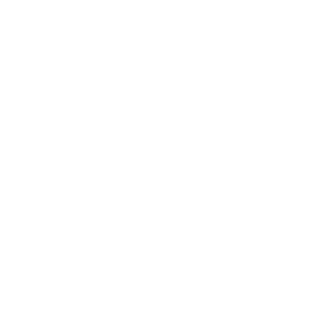

# Advanced Vanilla Objects

{ width="240" }

**Advanced Vanilla Objects** (AVO) fills vanilla objects with the functions they should have had: ACRE antennas you can connect a radio to, a weather station that reads the weather, tents you set up and pack up, and drawers, doors, lids and switches that could only be changed in the editor.

The project is entirely open-source and any contributions are welcome — see [Contributing](contributing.md).

!!! info "Requirements"
    AVO requires [CBA_A3](https://github.com/CBATeam/CBA_A3/releases/latest), [ACE3](https://github.com/acemod/ACE3) and Arma 3 Contact content. The antennas also need [ACRE2](https://github.com/IDI-Systems/acre2), and the BWA3 tent needs [BWA3](https://steamcommunity.com/sharedfiles/filedetails/?id=1200127537). If a dependency of an addon is missing, that addon is skipped instead of throwing errors.

## Core Features

- **[Antennas](objects/antennas.md)** — connect a compatible ACRE radio (PRC-117F, PRC-152) to the vanilla Contact satellite antennas, omni-directional antennas and Rugged communications terminals The command shelters of Global Mobilization (needs GM) have an antenna mast that is extended the same way: extend it, then connect a radio.
- **[Weather](objects/weather.md)** — read precise weather data at the portable weather station, and the wind at the windsock
- **[Tents](objects/tents.md)** — packed tent items that are set up with ACE's 3D placement, and a pack up action on the placed tents
- **[Animations](objects/animations.md)** — ACE actions for drawers, doors, lids, switches and more that could only be changed in the editor
- Matches nicely with the survival framework [Misery](compatibility.md#misery): camp in the tents and read the weather that your character feels
- Every action raises a [CBA event](scripting.md#events) that missions and mods can hook into
- Each addon can be turned off with its own [CBA setting](usage.md#settings)

## Getting Started

- [Installation](installation.md) — how to get the mod running alongside CBA and ACE3
- [Usage](usage.md) — how to use the objects in-game
- [Objects](objects/index.md) — every object that gets actions, with the classnames
- [Scripting & API](scripting.md) — events, functions and config for mission makers and modders
- [Components](components.md) — a tour of the addons that make up the mod
